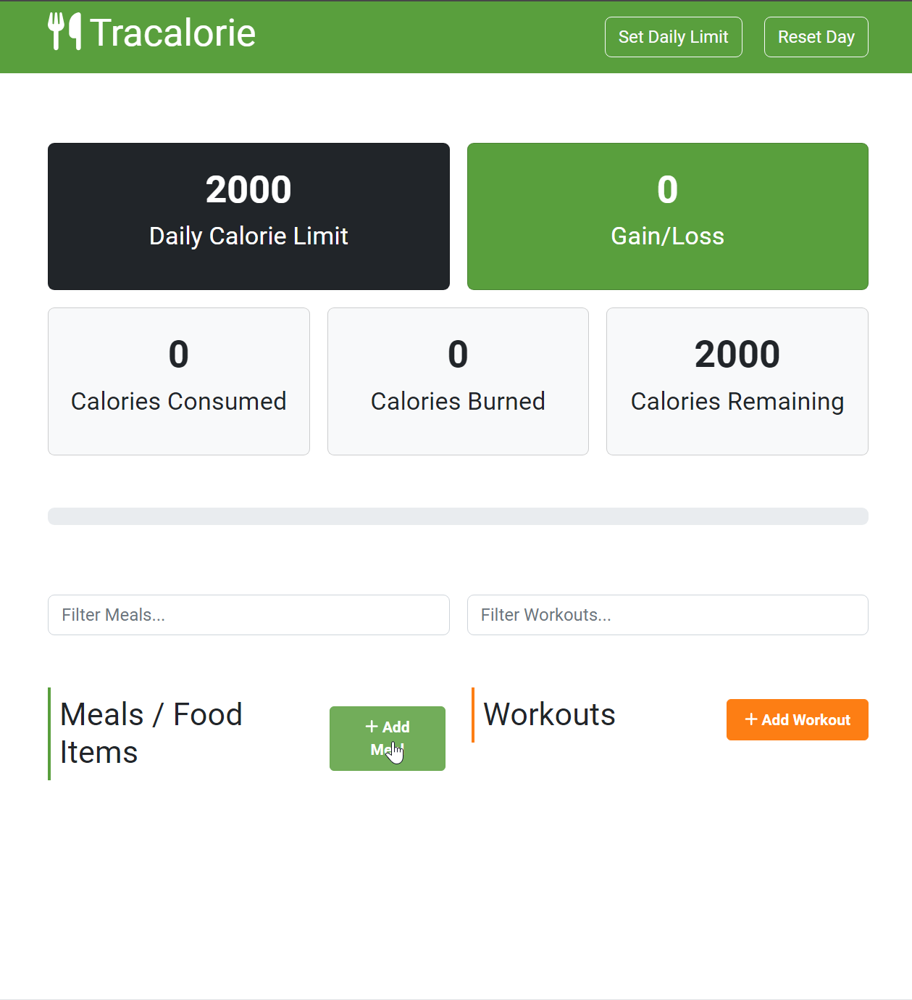

### 👋 **I am Erhan ERTEM**

### Udemy Modern JavaScript From The Beginning by Brad Traversy

#### **Objective:** Tracalorie App

-  OOP vanilla JS project with webpack & bootstrap

&emsp;

#### Link to Project &rarr; [Tracalorie](https://tracalorie-app-erhan-ertem.netlify.app)

#### Project Preview

---

  

Installed NPM packages and utilized APIs:

| Package command | Package link | Description |
| --------------- | ------------ | ----------- |

